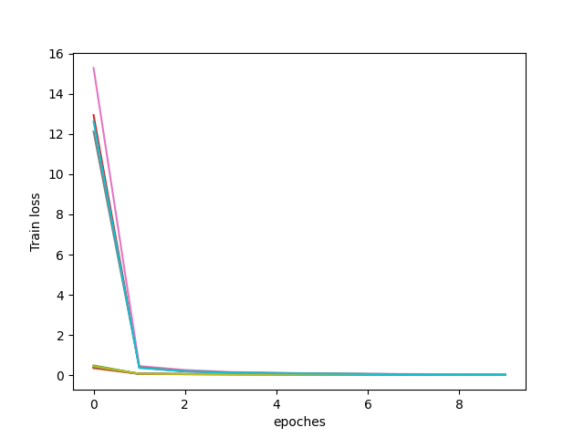
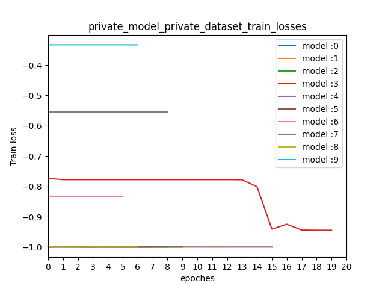
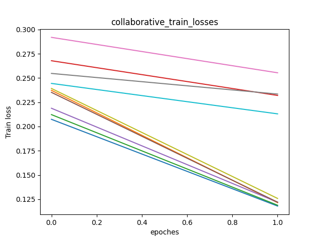
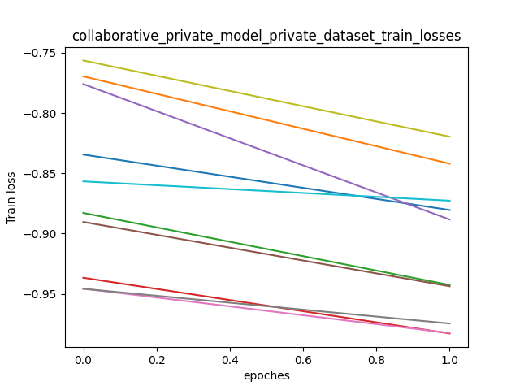
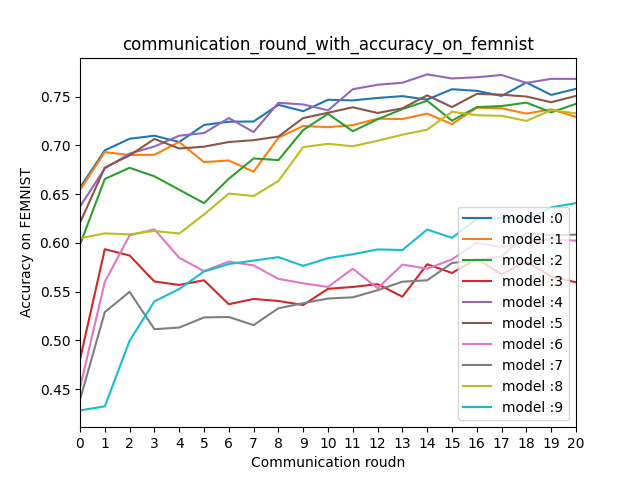

# FedMD_Pytorch

## Paper

FedMD: Heterogeneous Federated Learning via Model Distillation. 
Preprint on https://arxiv.org/abs/1910.03581.

## Environment

- GeForce GTX 1050 Ti
- Python 3.7.6
- torch 1.6.0
- torchvision 0.7.0

## Paper Abstract

Transfering learning is another  major framework addressing the scarcity of private data. In this work, our private datasets can be as small as a few samples per class. Threrefore using transfer learning from a large public dataet is imperative in addition to federated learning. We leverage the power of transfer learning in two ways. First, before entering the collaboration, each model is fully trained first on the public data and then on its own private data. Second, and more importantly, the blackbox models communicate based on their output class scores on samples from the public dataset. This is realized through knowledge distillation, which has been capable of transmitting learned information in a model agnostic way.

**迁移学习是解决私有数据稀缺的另一个主要框架**。 在这项工作中，我们的**私有数据集每个类可能只有几个样本**。 除了使用联合学习之外，还必须从大型公共数据集中使用转移学习。 我们以两种方式利用转移学习的力量。 首先，在进入协作之前，**首先充分利用公共数据，然后再利用其自己的私有数据来充分利用每种模型**。 其次，更重要的是，黑盒模型基于它们在公共数据集中样本上的输出类别分数来进行通信。 这是通过**知识蒸馏**实现的，它已经能够以模型不可知的方式传输学习到的信息。

We implement such a communication protocol by leveraging the power of transfer learning and knowledge distillation.

Transfer learning: Before a participant starts the collaboration phase, its model must first undergo the entire transfer learning process. It will be trained fully on the public dataset and then on its own private data. Therefore any future improvements are compared to this baseline.

转移学习：参与者开始协作阶段之前，其模型必须首先经历整个转移学习过程。 **将在公共数据集上对其进行全面培训，然后在其自己的私有数据上进行培训**。 因此，将将来的任何改进都与此基准进行比较。

交流：在这里 重新定义了公有数据集的作用，作为basis of communication between models，通过使用知识蒸馏。每个参与者的模型通过共享class scores 表达自己的模型能力，然后考虑到使用完整的lalrge public数据集导致巨大的交流压力。实际上，每次选择一个小很多的公有数据集的子集，这样cost 是可控的，does not scale with the complexity of participating models.

## 问题定义

m个参与者

每个local 有一个非常小的labeled dataset $D_k$ :={($x_i^k$,$y_i$)}^{N_k}_{i=1}（可能是或者不是同分布）

还有一个大的公有数据集 $D_0$ :={($x_i^0$,$y_i$)}^{N_0}_{i=1} 每个人都可以access

大家独立设计自己的模型$f_k$

目的是建立一个合作网络提升$f_k$性能（强于自己在自己的$D_k$和$D_0$上训练）

**FedMD**

Input：公有数据集$D_0$ 私有数据集$D_k$ 独立设计的模型$f_k$

Output：训练后的模型$f_k$

迁移学习：每方local的$f_k$先收敛在公有的$D_0$，再在私有数据集$D_k$

for j=1,2,....P do

交流：每个模型计算class score $f_k$(x_i^0) on 公有数据集，然后transmits 结果到中央服务器

整合：把大家的结果直接取平均	

Distribute: 每个参与者下载更新后的结果

Digest：参与者训练fk模型 去接近 在公有数据集上大家的平均结果

Revist：每个模型在自己的私有数据集上再训练几个周期

end
## File explanation
### data_utils.py
用于处理MNIST和FEMNIST数据集
|  Function name   | Input Parameters  | Output Parameters| Explanation
|  ----  | ----  |----  |----  |
| get_public_dataset  | args.dataset |data_train,data_test |获得公有数据集MNIST |
| convert_to_img  | root, train_set, test_set, train=True |NULL | 用于处理私有数据集-生成train和test的txt文件 |
|init_private_dataset|args.private_dataset|NULL|配合convert_to_img 完成对ubyte后缀数据集的处理，FEMNIST需要额外处理|
|default_loader|path|Image.open(path)|用于打开对应的图片|
|get_private_dataset|args.private_dataset|data_train,data_test|获得未筛选过的私有数据集FEMNIST|
|get_private_dataset_balanced|args.private_dataset|data_train,data_test|获得筛选过类（a-f）的私有数据集|
|FEMNIST_iid|dataset,num_users|dict_users|用于生成私有数据集是iid模式的数据标签索引字典|
|MNIST_random|dataset, epochs|dict_epoch|用于生成用于合作训练的公有训练集，每次5000张，索引字典|

### models.py

|  Class name   | Input Shape  | Output Shape| Explanation
|  ----  | ----  |----  |----  |
| CNN_3layer_fc_model_removelogsoftmax  | 1,28,28 |16,1 |用于模型的交流 移除了Softmax |
| CNN_2layer_fc_model_removelogsoftmax  | 1,28,28 |16,1 |用于模型的交流 移除了Softmax |
| CNN_3layer_fc_model  | 1,28,28 |16,1 |用于模拟local的模型 |
| CNN_2layer_fc_model  | 1,28,28 |16,1 |用于模拟local的模型 |

### utils.py
一些高频的方法就放一起了
|  Function name   | Input Parameters  | Output Parameters| Explanation
|  ----  | ----  |----  |----  |
| get_model_list  | url,modelsindex,models |model_list,model_type_list |用于获取之前训练的模型的权重和对应的类别list|
| get_model_list_test_acuracy  | url,modelsindex,models |model_list |用于获取之前训练的模型的权重list|

### pretrained_public_mnist_initial.py
用于初始化各个local的私有模型在MNIST数据集上

|  Parametes   | default value  | Options| Explanation
|  ----  | ----  |----  |----  |
| gpu  | 1 |0，1 |choose to use GPU or CPU |
| dataset  | 'mnist' |'mnist' |name of dataset |
| user_number  | 1 |0，1 |number of user join in Federated Learning|
| lr  | 0.01 |float number |learning rate |
| optimizer  | 'sgd' |'sgd','adam'|type of optimizer |
| epoch  | 10 |int number |number of epoch to train |

|  Function name   | Input Parameters  | Output Parameters| Explanation
|  ----  | ----  |----  |----  |
| train_models  | device,models,modelsindex,train_dataset,lr,optimizer,epochs |NULL |用于训练私有数据集在MNIST数据集上|

### pretrained_public_mnist_continue.py
用于继续训练各个locla的私有模型在MNIST数据集上，直到模型收敛
|  Parametes   | default value  | Options| Explanation
|  ----  | ----  |----  |----  |
| gpu  | 1 |0，1 |choose to use GPU or CPU |
| dataset  | 'mnist' |'mnist' |name of dataset |
| initialurl  | 'Src\Model' |String  |place to save the initial model |
| continue_epoch  | 10 |int number |number of epoch to continue |
| lr  | 0.01 |float number |learning rate |
| optimizer  | 'sgd' |'sgd','adam'|type of optimizer |

|  Function name   | Input Parameters  | Output Parameters| Explanation
|  ----  | ----  |----  |----  |
|continue_train_models|args|NULL|用于继续训练初始化模型，然后参数详见option.py|

### pretrained_public_mnist_Accuracy.py
用于检测在公有数据集上是否收敛
|  Parametes   | default value  | Options| Explanation
|  ----  | ----  |----  |----  |
| gpu  | 1 |0，1 |choose to use GPU or CPU |
| dataset  | 'mnist' |'mnist' |name of dataset |
| initialurl  | 'Src\Model' |String  |place to save the initial model |

|  Function name   | Input Parameters  | Output Parameters| Explanation
|  ----  | ----  |----  |----  |
| test_accuracy_initialmodel  |args |NULL |用于检测第一步public上训练的模型是否准确度ok|

|Model index|pre-trained test accuracies on MNIST|
|--|--|
|1|0.9829|
|2|0.9832|
|3|0.9856|
|4|0.9831|
|5|0.982|
|6|0.9859|
|7|0.9861|
|8|0.983|
|9|0.9855|
### private_model_femnist_balanced.py
用于继续训练各个local的私有模型在各自的私有FEMNIST数据集上
|  Parametes   | default value  | Options| Explanation
|  ----  | ----  |----  |----  |
| gpu  | 1 |0，1 |choose to use GPU or CPU |
| dataset  | 'mnist' |'mnist' |name of dataset |
| private_dataset  | 'FEMNIST' |'FEMNIST' |name of private dataset |
| initialurl  | 'Src\Model' |String  |place to save the initial model |
| privateurl  | 'Src\PrivateModel' |String  |place to save the private model which means continue train....... |
|new_private_training|True|True,False|whether train model from initial condition|
| privateepoch  | 20 |int number |number of epoch to private train |
| lr  | 0.01 |float number |learning rate |
| optimizer  | 'sgd' |'sgd','adam'|type of optimizer |

|  Class name   | Explanation
|  ---- |----  |
| DatasetSplit  |用于切割FEMNIST根据对应的索引|

|  Function name   | Input Parameters  | Output Parameters| Explanation
|  ----  | ----  |----  |----  |
|private_dataset_train|args|NULL|用于对各个私有模型在各自的私有数据集上进行训练|

### private_model_femnist_Accuracy.py
用于检测在各自私有数据集上是否收敛
|  Parametes   | default value  | Options| Explanation
|  ----  | ----  |----  |----  |
| gpu  | 1 |0，1 |choose to use GPU or CPU |
| dataset  | 'mnist' |'mnist' |name of dataset |
| privateurl  | 'Src\PrivateModel' |String  |place to save the private model  |

|  Function name   | Input Parameters  | Output Parameters| Explanation
|  ----  | ----  |----  |----  |
| test_accuracy_privateinitialmodel  |args |NULL |用于检测私有训练的模型是否准确度ok|

|Model index|private model test accuracies on FEMNIST|
|--|--|
|0|0.4608333333333333|
|1|0.5616666666666666|
|2| 0.498125|
|3|0.43604166666666666|
|4|0.5135416666666667|
|5|0.5397916666666667|
|6|0.39479166666666665|
|7|0.4725|
|8| 0.398125|
|9| 0.5091666666666667

**假设数据不存在阻塞**
|Model index|private model test accuracies on FEMNIST|
|--|--|
|0|0.89|
|1|0.8835416666666667|
|2| 0.88|
|3| 0.915|
|4|0.9170833333333334|
|5|0.881875|
|6|0.8975|
|7|0.893125|
|8| 0.8822916666666667|
|9| 0.9177083333333333|

### collaborative_train_balanced_mnist.py
|  Parametes   | default value  | Options| Explanation
|  ----  | ----  |----  |----  |
| gpu  | 1 |0，1 |choose to use GPU or CPU |
| dataset  | 'mnist' |'mnist' |name of dataset |
| private_dataset  | 'FEMNIST' |'FEMNIST' |name of private dataset |
| Collaborativeurl  | 'Src\CollaborativeModel' |String  |place to save the Collaborative model |
| privateurl  | 'Src\PrivateModel' |String  |place to save the private model which means continue train....... |
|new_collaborative_training|True|True,False|whether train model from initial condition|
| collaborative_epoch  | 5 |int number |number of epoch to collaborative train on Public|
| lr  | 0.01 |float number |learning rate |
| optimizer  | 'sgd' |'sgd','adam'|type of optimizer |

|  Class name   | Explanation
|  ---- |----  |
| DatasetSplit  |用于切割FEMNIST根据对应的索引|

|  Function name   | Input Parameters  | Output Parameters| Explanation
|  ----  | ----  |----  |----  |
|collaborative_private_model_femnist_train|args|NULL|用于对各个私有模型在公有数据集上一期合作训练|

### collaborative_private_model_femnist_balanced.py
用于继续训练各个local的私有模型在各自的私有FEMNIST数据集上--Collaborative Training phase
|  Parametes   | default value  | Options| Explanation
|  ----  | ----  |----  |----  |
| gpu  | 1 |0，1 |choose to use GPU or CPU |
| dataset  | 'mnist' |'mnist' |name of dataset |
| private_dataset  | 'FEMNIST' |'FEMNIST' |name of private dataset |
| Collaborativeurl  | 'Src\CollaborativeModel' |String  |place to save the Collaborative model |
| Communication_private_epoch  | 10 |int number |Local private training during colaboratiive time |
| lr  | 0.01 |float number |learning rate |
| optimizer  | 'sgd' |'sgd','adam'|type of optimizer |

|  Class name   | Explanation
|  ---- |----  |
| DatasetSplit  |用于切割FEMNIST根据对应的索引|

|  Function name   | Input Parameters  | Output Parameters| Explanation
|  ----  | ----  |----  |----  |
|collaborative_private_model_femnist_train|args|NULL|用于对各个私有模型在各自的私有数据集上进行训练|

### private_model_femnist_Accuracy.py
用于检测在各自私有数据集上是否收敛
|  Parametes   | default value  | Options| Explanation
|  ----  | ----  |----  |----  |
| gpu  | 1 |0，1 |choose to use GPU or CPU |
| dataset  | 'mnist' |'mnist' |name of dataset |
| Collaborativeurl  | 'Src\CollaborativeModel' |String  |place to save the Collaborative model |

|  Function name   | Input Parameters  | Output Parameters| Explanation
|  ----  | ----  |----  |----  |
| test_accuracy_collaborativemodel  |args |accuracy_list |用于检测合作训练的模型是否准确度ok|

### Collaborative_step.py
用于模拟交流过程
|  Parametes   | default value  | Options| Explanation
|  ----  | ----  |----  |----  |
| Communicationepoch  | 10 |int  |Collaobrative epoch in Step3|

|  Function name   | Input Parameters  | Output Parameters| Explanation
|  ----  | ----  |----  |----  |
| transpose  |matrix |matrix |用于旋转矩阵 便于绘图|

